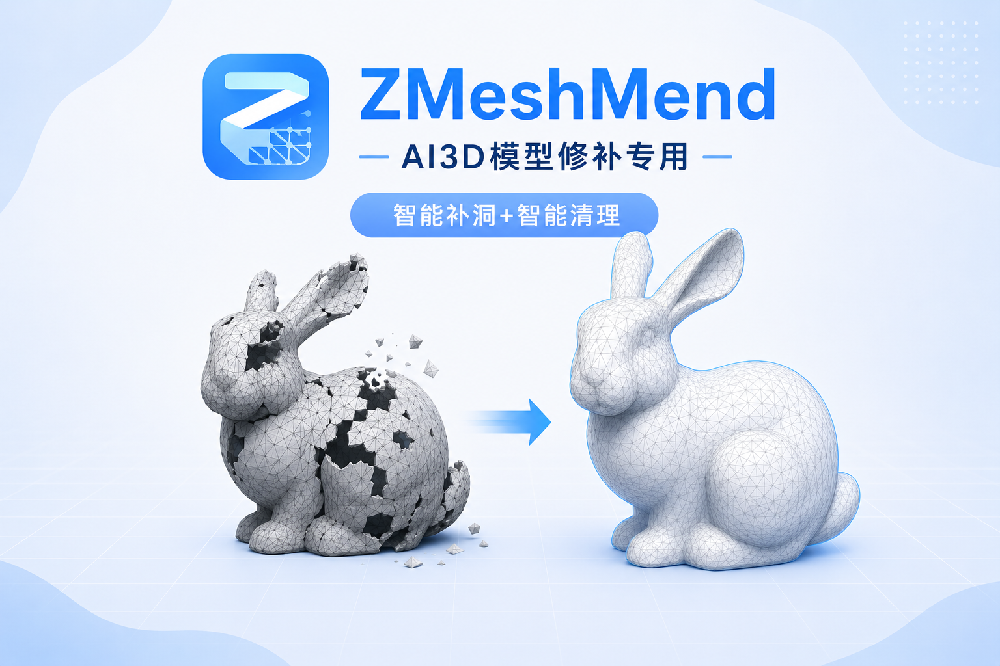

# ZMeshMend



[中文](#zmeshmend) | [English](#zmeshmend-1)

ZBrush 网格孔洞自动修复插件。一键闭合所有开放孔洞，支持 CGAL 智能曲率感知填充、碎片移除、遮罩驱动的模型清理和平滑开放边缘。

提供 **Python** 和 **ZScript** 两种版本，互不依赖。

## 下载

前往 [GitHub Releases](https://github.com/aniraiden/ZMeshMend/releases) 下载最新版本：

- **Python 版**: `Python_v1.1.0-smooth.zip`
- **ZScript 版**: `ZScript_v1.1.0-smooth.zip`


## 版本对比

| | Python 版 | ZScript 版 |
|---|---|---|
| 文件 | `ZMeshMend/ZMeshMend.py` | `ZMeshMend/ZMeshMend_ZScript.txt` |
| 入口 | `ZMeshMend_Launcher.py` | 直接 Load .txt |
| 依赖 | ZBrush Python API (2026+) | ZFileUtils64.dll |
| 兼容 | ZBrush 2026+ | ZBrush 2021+（含老版本） |
| CGAL 核心 | subprocess 调用 | LaunchAppWithFile 调用 |

## 功能

| 功能 | 说明 |
|------|------|
| **Close All Holes** | ZBrush 内置算法快速兜底 |
| **MendHoles + PolyGroup** | CGAL 算法智能填充，曲率感知，自动创建 PolyGroup (orig + fill) |
| **Mask-Based Cleanup** | 遮罩 → 删除 → 智能填充，全自动流程 |
| **Remove Small Fragments** | CGAL 连通性分析自动清理孤立碎片 |
| **Smooth Open Edge** | 边界 Chaikin + Laplacian 多圈平滑，法线投影保持体积 |


---

## Python 版安装

1. 将文件夹放置在电脑上任意位置（无需放入 ZBrush 插件目录）。

2. 在 ZBrush 中：菜单 `ZScript` → `Python Scripting` → `Load`
   选择 `ZMeshMend_Launcher.py`

3. 插件面板将自动出现在 ZBrush UI 中。

> Python 版要求 ZBrush 2026 及以上版本。

## ZScript 版安装

1. 将 `ZMeshMend` 文件夹中的内容复制到：
   ```
   X:\...\Maxon\ZBrush 20XX\ZStartup\ZPlugs64\
   ```

   最终结构：
   ```
   ZStartup\ZPlugs64\
     ZMeshMend_ZScript.txt
     ZMeshMendData\
       zmeshmend_core.exe
       ZFileUtils64.dll
       ...
   ```

2. 启动 ZBrush，菜单 `ZScript` → `Load` → 选择 `ZMeshMend_ZScript.txt`
   ZBrush 会编译生成 `.zsc`，插件出现在 `ZPlugin` → `ZMeshMend` 面板。

3. 编程生成 `.zsc` 文件后，以后启动 ZBrush 即可自动加载插件。

4. 如 `.zsc` 未生成，删除已有 `.zsc` 后重新 Load。

---

## 配置

两种版本共用同一配置文件 `ZMeshMend/ZMeshMend_config.txt`：

| 参数 | 默认值 | 说明 |
|------|--------|------|
| `maskSharpenPasses` | 1 | 遮罩锐化次数 |
| `maskGrowRings` | 1 | 遮罩扩展环数 |
| `removeSmallFragments` | 1 | 是否移除小碎片 |
| `fragmentMinFraction` | 0.01 | 碎片保留的最小面数占比 |
| `fragmentMinFaces` | 50 | 碎片保留的绝对最小面数 |
| `smoothIterations` | 2 | 平滑边缘迭代次数（1-20） |
| `smoothRings` | 3 | 平滑边缘向内扩展圈数（1-20） |

ZScript 版可直接在面板 Settings 子面板中调整。

---

## 可选：编译 CGAL 核心

两种版本共用 `zmeshmend_core.exe`。如需重新编译：

**前置条件：** Visual Studio 2022 + CMake 3.16+ + [vcpkg](https://github.com/microsoft/vcpkg)

```bash
# 1. 安装 CGAL（一次性）
cd C:\path\to\vcpkg
.\vcpkg install cgal:x64-windows

# 2. 编译
cd ZMeshMendData
powershell -File run_build.ps1
```

> 编译产物 `zmeshmend_core.exe` 会自动复制到 `ZMeshMendData/`。如未检测到，插件自动回退到 ZBrush 内置算法。

---

## 项目结构

```
ZMeshMend/
├── README.md
├── ZMeshMend_Launcher.py              # Python 版入口
├── ZMeshMend/
│   ├── __init__.py
│   ├── init.py
│   ├── ZMeshMend.py                   # Python 版主逻辑
│   ├── ZMeshMend_ZScript.txt          # ZScript 版主逻辑
│   ├── ZMeshMend_config.txt           # 共享配置
├── doc/
│   ├── project-reference.md            # 项目权威参考手册
│   ├── architecture.md                 # 架构文档
│   ├── roadmap.md                      # 开发路线图
│   ├── smooth-open-edge.md             # 平滑边缘功能规划
│   └── branches.md                     # 分支说明
├── reference/                          # 外部参考资料（只读）
│   ├── ZFileUtils_2021_01A/            # ZFileUtils 官方示例
│   └── zscripting.txt                  # ZScript 语法参考
├── ZMeshMendData/
│   ├── CMakeLists.txt                 # C++ 构建配置
│   ├── build.bat                      # 一键编译（旧方式）
│   ├── run_build.ps1                  # 一键编译（推荐）
│   ├── zmeshmend_core.cpp             # CGAL 孔洞填充引擎
│   ├── zmeshmend_core.exe             # 编译产物
│   ├── ZFileUtils64.dll               # ZScript 文件工具 DLL
│   ├── ZMeshMend_pipeline.py          # Python 管线辅助
│   ├── GoZ_Mesh.cpp / .h              # GoZ 网格读写
│   ├── GoZ_Utils.cpp / .h             # GoZ 工具函数
│   ├── GoZ_Binary.h / GoZ_Config.h    # GoZ 格式定义
│   └── *.dll                          # CGAL 运行时依赖

```

## 依赖

- **Python 版:** ZBrush 2026+ Python API（`zbrush` 模块）
- **ZScript 版:** ZFileUtils64.dll（内置）
- **C++ 核心:** CGAL 6.x, Boost 1.91+, Eigen3, GMP, MPFR

## 许可

- **GoZ SDK 文件**（`GoZ_Mesh.*`, `GoZ_Utils.*`, `GoZ_Binary.h`, `GoZ_Config.h`）：版权归 Maxon/Pixologic 所有
- **其余代码**：MIT License

## 作者

- **开发者**: [Aniraiden]
- **B站主页**: [(https://space.bilibili.com/3129234)]
- **GitHub**: https://github.com/aniraiden
- **项目主页**: https://github.com/aniraiden/ZMeshMend

如有问题或建议，欢迎通过 GitHub Issues 反馈。

---

# ZMeshMend

[中文](#zmeshmend) | [English](#zmeshmend-1)

A ZBrush plugin for automatic mesh hole repair. Close all open holes with one click, featuring CGAL intelligent curvature-aware filling, fragment removal, mask-driven model cleanup, and smooth open edge processing.

Available in both **Python** and **ZScript** versions, independent of each other.

## Download

Visit [GitHub Releases](https://github.com/aniraiden/ZMeshMend/releases) to download the latest version:

- **Python Version**: `Python_v1.1.0-smooth.zip`
- **ZScript Version**: `ZScript_v1.1.0-smooth.zip`

## Version Comparison

| | Python Version | ZScript Version |
|---|---|---|
| File | `ZMeshMend/ZMeshMend.py` | `ZMeshMend/ZMeshMend_ZScript.txt` |
| Entry Point | `ZMeshMend_Launcher.py` | Load .txt directly |
| Dependencies | ZBrush Python API (2026+) | ZFileUtils64.dll |
| Compatibility | ZBrush 2026+ | ZBrush 2021+ (including older versions) |
| CGAL Core | subprocess call | LaunchAppWithFile call |

## Features

| Feature | Description |
|---------|-------------|
| **Close All Holes** | Quick fallback using ZBrush built-in algorithm |
| **MendHoles + PolyGroup** | CGAL intelligent filling with curvature awareness, auto-creates PolyGroup (orig + fill) |
| **Mask-Based Cleanup** | Mask → Delete → Smart Fill, fully automated workflow |
| **Remove Small Fragments** | CGAL connectivity analysis for automatic isolated fragment cleanup |
| **Smooth Open Edge** | Boundary Chaikin + Laplacian multi-ring smooth with normal projection |

---

## Python Version Installation

1. Place the folder anywhere on your computer (no need to put it in the ZBrush plugin directory).

2. In ZBrush: menu `ZScript` → `Python Scripting` → `Load`
   Select `ZMeshMend_Launcher.py`

3. The plugin panel will automatically appear in the ZBrush UI.

> Python version requires ZBrush 2026 or later.

## ZScript Version Installation

1. Copy the contents of `ZMeshMend` folder, to:
   ```
   X:\...\Maxon\ZBrush 20XX\ZStartup\ZPlugs64\
   ```

   Final structure:
   ```
   ZStartup\ZPlugs64\
     ZMeshMend_ZScript.txt
     ZMeshMendData\
       zmeshmend_core.exe
       ZFileUtils64.dll
       ...
   ```

2. Launch ZBrush, menu `ZScript` → `Load` → select `ZMeshMend_ZScript.txt`
   ZBrush will compile and generate a `.zsc` file, and the plugin appears in the `ZPlugin` → `ZMeshMend` panel.

3. Once the `.zsc` file is generated, the plugin will auto-load on subsequent ZBrush launches.

4. If the `.zsc` is not generated, delete any existing `.zsc` and re-Load.

---

## Configuration

Both versions share the same configuration file `ZMeshMend/ZMeshMend_config.txt`:

| Parameter | Default | Description |
|-----------|---------|-------------|
| `maskSharpenPasses` | 1 | Number of mask sharpen passes |
| `maskGrowRings` | 1 | Number of mask grow rings |
| `removeSmallFragments` | 1 | Whether to remove small fragments |
| `fragmentMinFraction` | 0.01 | Minimum face fraction to retain a fragment |
| `fragmentMinFaces` | 50 | Absolute minimum face count to retain a fragment |
| `smoothIterations` | 2 | Smooth open edge iterations (1-20) |
| `smoothRings` | 3 | Smooth open edge inward rings (1-20) |

ZScript version can also adjust settings directly in the panel's Settings sub-panel.

---

## Optional: Build CGAL Core

Both versions share `zmeshmend_core.exe`. To rebuild:

**Prerequisites:** Visual Studio 2022 + CMake 3.16+ + [vcpkg](https://github.com/microsoft/vcpkg)

```bash
# 1. Install CGAL (one-time)
cd C:\path\to\vcpkg
.\vcpkg install cgal:x64-windows

# 2. Build
cd ZMeshMendData
powershell -File run_build.ps1
```

> The build output `zmeshmend_core.exe` is automatically copied to `ZMeshMendData/`. If not detected, the plugin falls back to ZBrush built-in algorithms.

---

## Project Structure

```
ZMeshMend/
├── README.md
├── ZMeshMend_Launcher.py              # Python version entry point
├── ZMeshMend/
│   ├── __init__.py
│   ├── init.py
│   ├── ZMeshMend.py                   # Python version main logic
│   ├── ZMeshMend_ZScript.txt          # ZScript version main logic
│   ├── ZMeshMend_config.txt           # Shared configuration
├── doc/
│   ├── project-reference.md            # Project authoritative reference
│   ├── architecture.md                 # Architecture document
│   ├── roadmap.md                      # Development roadmap
│   ├── smooth-open-edge.md             # Smooth open edge spec
│   └── branches.md                     # Branch overview
├── reference/                          # External reference (read-only)
│   ├── ZFileUtils_2021_01A/            # ZFileUtils official examples
│   └── zscripting.txt                  # ZScript syntax reference
├── ZMeshMendData/
│   ├── CMakeLists.txt                 # C++ build configuration
│   ├── build.bat                      # One-click build (legacy)
│   ├── run_build.ps1                  # One-click build (recommended)
│   ├── zmeshmend_core.cpp             # CGAL hole filling engine
│   ├── zmeshmend_core.exe             # Build output
│   ├── ZFileUtils64.dll               # ZScript file utility DLL
│   ├── ZMeshMend_pipeline.py          # Python pipeline helper
│   ├── GoZ_Mesh.cpp / .h              # GoZ mesh I/O
│   ├── GoZ_Utils.cpp / .h             # GoZ utility functions
│   ├── GoZ_Binary.h / GoZ_Config.h    # GoZ format definitions
│   └── *.dll                          # CGAL runtime dependencies
```

## Dependencies

- **Python Version:** ZBrush 2026+ Python API (`zbrush` module)
- **ZScript Version:** ZFileUtils64.dll (bundled)
- **C++ Core:** CGAL 6.x, Boost 1.91+, Eigen3, GMP, MPFR

## License

- **GoZ SDK files** (`GoZ_Mesh.*`, `GoZ_Utils.*`, `GoZ_Binary.h`, `GoZ_Config.h`): Copyright Maxon/Pixologic
- **All other code**: MIT License

## Author

- **Developer**: [Aniraiden]
- **Bilibili**: [(https://space.bilibili.com/3129234)]
- **GitHub**: https://github.com/aniraiden
- **Project Homepage**: https://github.com/aniraiden/ZMeshMend

For questions or suggestions, please submit them via GitHub Issues.
